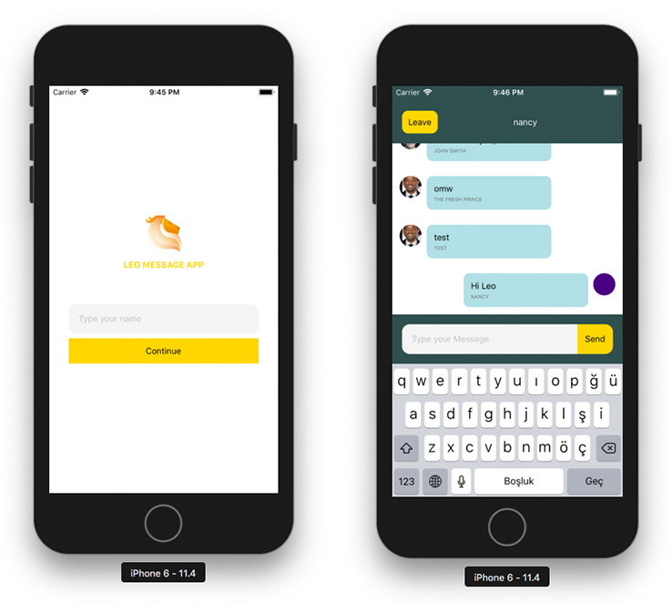

# Leo Messaging App
This is a React Native messaging app that satisfies these requirements.

## Requirements Met
- [x] Redux architecture implemented for state management
- [x] Redux-thunk middleware used for asynchronous actions
- [x] Two screens added for login and message
- [x] Nickname validation & warning to check at least two characters
- [x] On Message screen display user's nickname on title and leave button
- [x] Fetch previous messages from external resource
- [x] User's messages aligned to right side while others aligned to left
- [x] New messages come into view with a scroll animation
- [x] App persists user session data on Asyncstorage excluding message history


## Instructions
Install all project dependencies and start.
```bash
`npm install`
````

```bash
npm start
```

Press a to run on Android device/emulator, or i to run on iOS simulator.